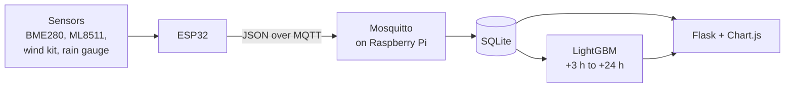

I build software that ends somewhere physical: a weather station outside, a lamp on a desk, a phone in someone's hand. What I enjoy most is following one reading all the way through, from the firmware on an ESP32, over MQTT, into a database on a Raspberry Pi, and out the other side as a chart, an API response or a forecast.

*Crenguța* is Romanian for "little branch". The twig in the banner is also, if you squint, a git graph.

### Bachelor's thesis: an autonomous weather station

[**Statie-Meteo-Inteligenta**](https://github.com/CiobanicaCrenguta/Statie-Meteo-Inteligenta) runs outdoors on a solar panel. An ESP32 reads temperature, humidity, pressure, UV, wind speed, gusts, wind direction and rainfall, then publishes everything as JSON over MQTT. A Raspberry Pi stores the readings in SQLite, serves a Flask + Chart.js dashboard and runs LightGBM models that forecast 3 to 24 hours ahead.

### Other things I've made

| Project | What it does | Built with |
|---|---|---|
| [SmartLamp](https://github.com/CiobanicaCrenguta/SmartLamp) | Android app for an ESP32 LED-matrix lamp. It changes modes and brightness over Wi-Fi, turns the lamp off from a notification, and has a music mode: it captures whatever the phone is playing, works out volume, beat and colour, and streams them to the lamp as 3-byte UDP packets. | `Kotlin` `Android` `OkHttp` `UDP` `ESP32` |
| [idp](https://github.com/CiobanicaCrenguta/idp) | Front end for a document classifier: drop in a scanned page and a DiT (Document Image Transformer) model predicts its type, with a confidence score and the top 3 alternatives. | `React` `Vite` `Tailwind CSS` |
| [Tema7_Cizme_De_Primavara](https://github.com/CiobanicaCrenguta/Tema7_Cizme_De_Primavara) | REST API for products and categories, with JPA and PostgreSQL. The name is a pun: *cizme de primăvară* means "spring boots". | `Java` `Spring Boot` `PostgreSQL` |
| [Homework_IA](https://github.com/CiobanicaCrenguta/Homework_IA) | The travelling salesman problem solved three ways (BFS, uniform-cost search and A*), with the routes plotted side by side. | `Python` |

### What I work with

| Layer | Tools |
|---|---|
| Hardware & firmware | `C++` `ESP32` `Arduino` `Raspberry Pi` |
| Messaging & data | `MQTT` `Mosquitto` `SQLite` `PostgreSQL` |
| Backend | `Python` `Flask` `Java` `Spring Boot` |
| Web & mobile | `TypeScript` `JavaScript` `React` `Next.js` `Kotlin` |
| Machine learning | `LightGBM` `pandas` `Google Colab` |
| Everyday tools | `Git` `Docker` `Linux` `systemd` |

### Activity

<picture>
  <source media="(prefers-color-scheme: dark)" srcset="https://raw.githubusercontent.com/CiobanicaCrenguta/CiobanicaCrenguta/main/profile/snake-dark.svg">
  
</picture>

<!-- Uncomment once the contribution graph gets busier:

-->

### Contact

[GitHub](https://github.com/CiobanicaCrenguta)
<!-- [LinkedIn](https://www.linkedin.com/in/...)  [Email](mailto:...) -->
